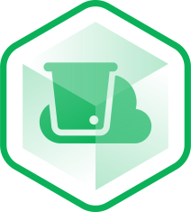

<p align="center"></p>

<h1 align="center">Linode Object Storage for Craft CMS</h1>

This plugin provides a [Linode Object Storage](https://www.linode.com/products/object-storage/) integration for [Craft CMS](https://craftcms.com/).

## Requirements

This plugin requires Craft CMS 3.1.0 or later.

## Installation

You can install this plugin from the Plugin Store or with Composer.

#### From the Plugin Store

Go to the Plugin Store in your project’s Control Panel and search for “Linode Object Storage”. Then click on the “Install” button in its modal window.

#### With Composer

Open your terminal and run the following commands:

```bash
# go to the project directory
cd /path/to/my-project.test

# tell Composer to load the plugin
composer require mwikala/linode-s3

# tell Craft to install the plugin
./craft install/plugin linode-s3
```

## Setup

To create a new asset volume for your Amazon S3 bucket, go to Settings → Assets, create a new volume, and set the Volume Type setting to “Linode S3”.

## Environment Variables

To allow you to setup different Buckets for different environments, you can set these handy environment variables in your `.env` and `.env.example` (so you don't forget them after pushing to source control):

```env
# The Linode Object Storage Access Key with read/write access to Buckets
LINODE_S3_ACCESS_KEY=

# The Linode Object Storage Access Secret
LINODE_S3_SECRET=

# THE URL endpoint for your Buckets
LINODE_S3_ENDPOINT=

# The region your Object Storage bucket is in
LINODE_S3_REGION=

# The name of your bucket
LINODE_S3_BUCKET=

# The URL of the bucket
LINODE_S3_BUCKET_URL=
```

You can also overwrite the settings of a volume using a `config/volumes.php` file. That would look something like this:

```php
<?php

return [
    'linodeOSVolumeHandle' => [
        'hasUrls' => true,
        'url' => getenv('LINODE_S3_BUCKET_URL'),
        'keyId' => getenv('LINODE_S3_ACCESS_KEY'),
        'secret' => getenv('LINODE_S3_SECRET'),
        'endpoint' => getenv('LINODE_S3_ENDPOINT'),
        'region' => getenv('LINODE_S3_REGION'),
        'bucket' => getenv('LINODE_S3_BUCKET'),
    ],
];
```

## License & Support

This plugin is released under the [MIT license](./LICENSE.md), meaning you can do whatever you please with it.

> If you experience any issues with the plugin then open an issue here and I'll try get it fixed/answered whenever I have some free time