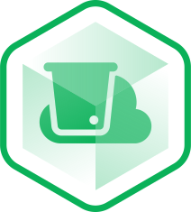

<p align="center"></p>

<h1 align="center">Linode Object Storage for Craft CMS</h1>

This plugin provides a [Linode Object Storage](https://www.linode.com/products/object-storage/) filesystem for [Craft CMS](https://craftcms.com/).

## Requirements

- Craft CMS 4.0+ or 5.0+
- PHP 8.0.2+
- PHP 8.2+ when running Craft CMS 5

## Installation

Install the plugin from the Plugin Store, or with Composer:

```bash
cd /path/to/my-craft-project
composer require mwikala/linode-s3
php craft plugin/install linode-s3
```

The Composer package name is `mwikala/linode-s3` and the Craft plugin handle is `linode-s3`.

## Setup

1. In Linode Cloud Manager, create an Object Storage bucket and an access key with access to that bucket.
2. In Craft, go to Settings → Filesystems and create a new filesystem.
3. Set **Filesystem Type** to **Linode Object Storage**.
4. Enter your bucket details, or use environment variables such as `$LINODE_S3_BUCKET`.
5. If files should be publicly accessible, enable **Files in this filesystem have public URLs** and set **Base URL** to the bucket URL or CDN/custom-domain URL.

Linode bucket URLs usually look like this:

```text
https://[bucket-name].[region].linodeobjects.com
```

The plugin’s **API Endpoint** setting should be the same URL without the bucket name:

```text
https://[region].linodeobjects.com
```

For example, a bucket URL of `https://assets.eu-central-1.linodeobjects.com` would use:

| Setting | Value |
| --- | --- |
| API Endpoint | `https://eu-central-1.linodeobjects.com` |
| Region | `eu-central-1` |
| Bucket | `assets` |
| Base URL | `https://assets.eu-central-1.linodeobjects.com` |

If you set a **Subfolder**, don’t append it to the **Base URL**. Craft adds the subfolder automatically when generating asset URLs.

## Environment Variables

You can keep credentials and environment-specific bucket details in your project’s `.env` file:

```env
# Linode Object Storage access key with read/write access to the bucket
LINODE_S3_ACCESS_KEY=

# Linode Object Storage secret key
LINODE_S3_SECRET=

# API endpoint, e.g. https://eu-central-1.linodeobjects.com
LINODE_S3_ENDPOINT=

# Region, e.g. eu-central-1
LINODE_S3_REGION=

# Bucket name, e.g. assets
LINODE_S3_BUCKET=

# Public bucket, CDN, or custom-domain URL
LINODE_S3_BUCKET_URL=
```

Then use these values in the filesystem settings:

| Setting | Value |
| --- | --- |
| API Endpoint | `$LINODE_S3_ENDPOINT` |
| Region | `$LINODE_S3_REGION` |
| Bucket | `$LINODE_S3_BUCKET` |
| Access Key ID | `$LINODE_S3_ACCESS_KEY` |
| Secret Access Key | `$LINODE_S3_SECRET` |
| Base URL | `$LINODE_S3_BUCKET_URL` |

Do not commit real access keys or secrets to source control.

## License & Support

This plugin is released under the [MIT license](./LICENSE.md).

If you experience any issues with the plugin, please open an issue on GitHub and I’ll try to get it fixed or answered when I have some free time.
